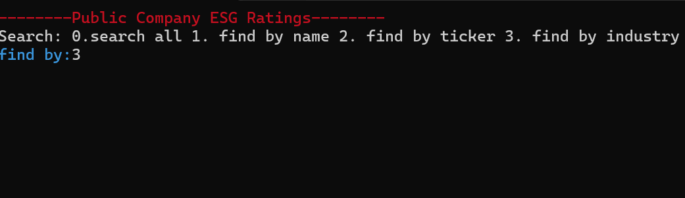
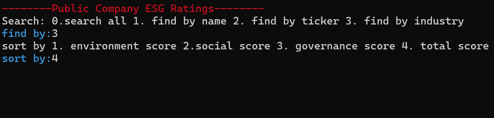
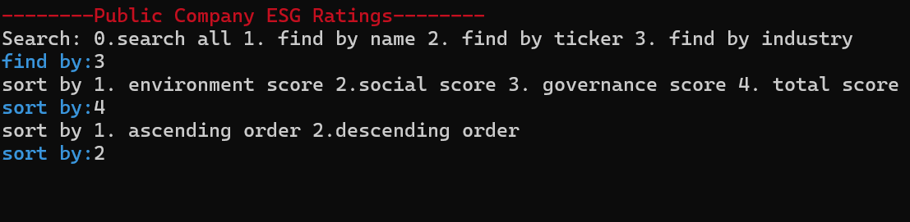
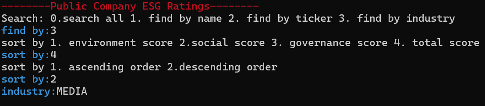
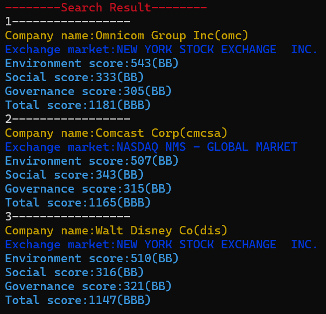

## ESG-Tracker
***
#### About ESG Tracker

+ Aimed to make a program that displays companies' information after sorting and searching.
+ Started the project on 26MAR24.

#### Development Environment

+ C++

#### Features

+ Search company by name, ticker or industry.
+ Sort Data by environment score, social score, governance score, or total score.
+ Displays companies' name, exchange market, environment score/grade, social score/grade, governance score/grade, and total score/grade.

### How to Use

  

1) type in 0 to search all, 1 to search by name, 2 to search by ticker, or 3 to search by industry

  

2) type in 1 to sort by environment score, 2 to sort by social score, 3 to sort by governance score, or 4 to sort by total score.

  

3) type in 1 to sort in ascending order or 2 to sort in descending order.

  

4) type in the company's name, ticker, or industry.

  

5) displays the companies' name, exchange market, environment score/grade, social score/grade, governance score/grade, and total score/grade.

#### Notes

+ How I made the program: (in Korean)

#### Reference

+ Raw data file url: https://www.kaggle.com/datasets/alistairking/public-company-esg-ratings-dataset
